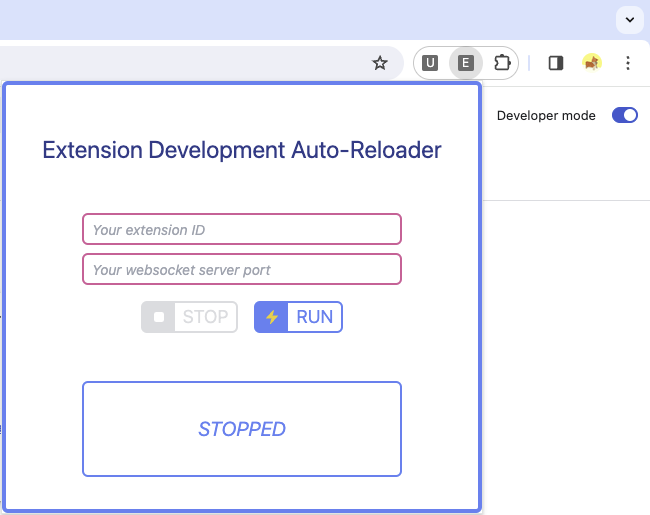
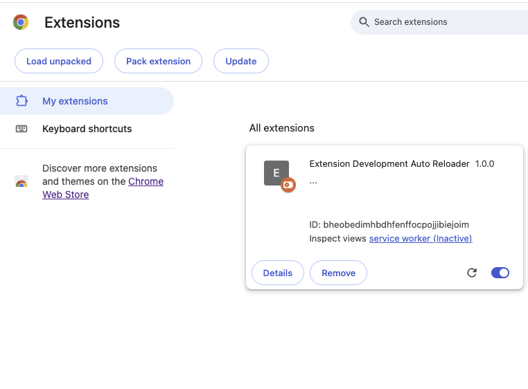
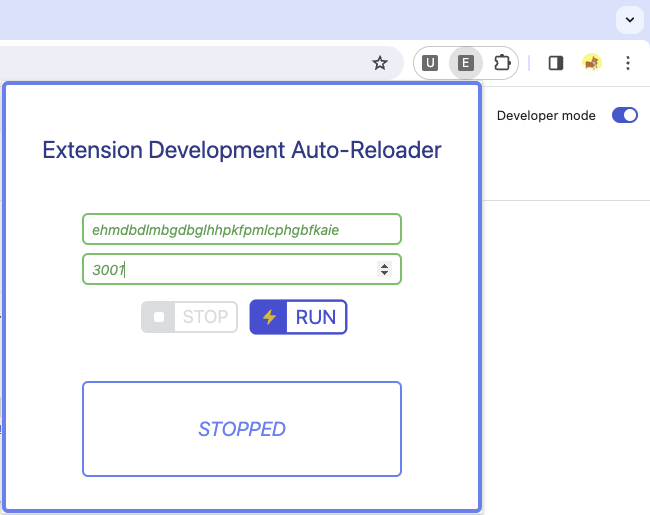
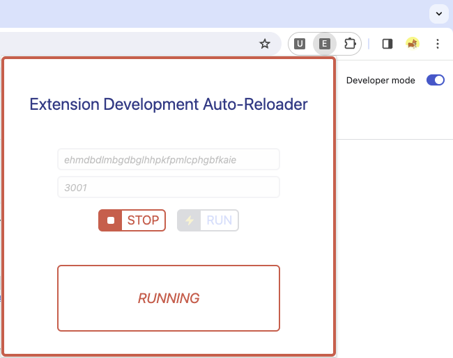

# Extension Auto Reloader

Extension auto reloader is an extension and npm package combination that automatically reloads your unpacked chrome extension when you save changes to your files during development.

It requires a websocket connection to do so, which you setup with this npm package.

## Project Structure and running

1. In your "src" directory make a new subfolder "extension" and put your extension files in there. Your manifest.json, serviceWorker.ts and contentScript/s.ts files should be in there. Yes we are using typescript.

```bash
src
├── extension
│   ├── manifest.json
│   ├── serviceWorker.ts
│   ├── contentScript.ts
```

2. Now add a new script to your package json to run your Vite Build step in watch mode. You cannot make an extension work in dev mode, as the unpacked extension requires generated files. Hence we use build mode:

```json
{
  "scripts": {
    ...
    "build:watch": "vite build --watch"
    ...
  }
}
```

3. In your vite.config.ts file, add the following plugins (from this package) and modify the build step to include your service worker (if applicable) and content scripts (if applicable):

```ts
...
import {
  extensionReloaderBuildStep,
  extensionReloaderWebSocket,
} from "vite-plugin-extension-reloader";
import copy from "rollup-plugin-copy";  // Highly recommended for copying static assets like icons
...

export default defineConfig({
 plugins: [
    // Your existing Vite plugins
    ...
    extensionReloaderBuildStep("src/extension/manifest.json"),
    extensionReloaderWatchExternal("src/extension/**/*")  // This is optional, but will watch for changes in your manifest
    extensionReloaderWebSocket(),
    ...
    copy({
      targets: [
        // Use glob patterns to match static files to copy
        {
          src: "src/extension/*",
          dest: "dist",
          ignore: ["**/*.js", "**/*.ts", "**/manifest.json"],
        },
      ],
      copyOnce: false,
      flatten: true,
    }),
  ],
  // Your existing config
  ...
  // Build step modifications
  build: {
    emptyOutDir: true,
    rollupOptions: {
      input: {
        main: path.resolve(__dirname, "index.html"),
        // Do this for each content script you have
        contentScript: path.resolve(
          __dirname,
          "src/extension/contentScript.ts"
        ),
        // Do this for your service worker
        serviceWorker: path.resolve(
          __dirname,
          "src/extension/serviceWorker.ts"
        ),
      },
      output: {
        entryFileNames: "[name].js",
        chunkFileNames: "[name].js",
        assetFileNames: "[name].[ext]",
      },
    },
  },
});
```

4. Now once you have everything setup, you should run the included websocket server. This is so we can automatically reload your extension. Run and note the port number:

```bash
# defaults to port 3001
npx wss-ext-reloader

# Or, define your own port eg "5000":
npx wss-ext-reloader --port <XXXXX>
```

5. Now you are ready to develop your extension! Run the build:watch script and start developing. When you save changes to your files, the websocket server will automatically reload your extension in the browser:

```bash
npm run build:watch
```

6. To load an unpacked extension in the browser, you must point to a file location for your extension. This will be the "dist" directory which is generated by the build step:

```bash
dist
├── manifest.json
├── serviceWorker.js
├── contentScript.js
├── main.js
├── index.html
... others
```

7. Now connect the extension auto reloader browser extension to the websocket server:



You can get your unpacked extensions ID from the manage extensions page in chrome: chrome://extensions/



Then enter the required information and hit run:



Now whenever ou make changes to your code, your extension will auto reload itself without you needing to do anything

To stop simply press stop:


